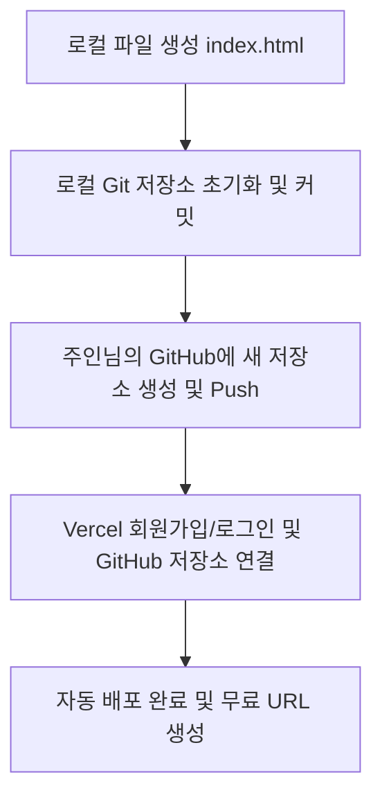

# 스마트 QR 코드 생성기 구현 및 Vercel 배포 계획서

안녕하세요, 주인님! 요청하신 스마트 QR 코드 생성기 웹페이지를 안전하게 생성하고, GitHub을 통해 Vercel로 배포하여 고유한 인터넷 주소(URL)를 만드는 작업을 진행하겠습니다. 

초보자이신 주인님의 눈높이에 맞춰 모든 과정을 아주 쉽고 상세하게 설명해 드릴 예정입니다.

---

## 1. 프로젝트 개요
주인님께서 제공해주신 HTML 코드 기반의 싱글 페이지 애플리케이션(SPA)을 제작하고, 이를 Git 버전 관리 및 GitHub 저장소를 거쳐 Vercel 무료 호스팅 서비스로 배포하여 실제 모바일이나 PC에서 접속할 수 있는 단독 웹사이트 URL을 생성합니다.

---

## 2. 제안하는 변경 사항 (파일 구조)

프로젝트 폴더 내에 생성할 파일들의 구성안입니다.

### [NEW] [index.html](file:///c:/Users/user/Desktop/큐알/index.html)
- 주인님께서 전달해주신 아름다운 UI 디자인과 기능이 담긴 HTML 파일입니다.
- HTML, CSS, JavaScript가 모두 한 파일 안에 포함되어 있어 관리가 쉽습니다.
- 코드의 각 기능(로고 영역, 입력창 영역, QR 생성 로직, JPG 다운로드 캔버스 로직)마다 한글 주석을 상세하게 추가하여 향후 수정하시기 편하게 만들겠습니다.

### [NEW] [docs/plans/01_qr_code_generator_deployment_plan.md](file:///c:/Users/user/Desktop/큐알/docs/plans/01_qr_code_generator_deployment_plan.md)
- 규칙 12번에 따라 개발 이력을 영구 보존하기 위해 이 계획서를 프로젝트 폴더 내에도 함께 저장합니다.

### [NEW] [.gitignore](file:///c:/Users/user/Desktop/큐알/.gitignore)
- GitHub에 올릴 때 제외할 불필요한 시스템 임시 파일들(.DS_Store, thumbs.db 등)을 걸러주는 설정 파일입니다.

---

## 3. GitHub 및 Vercel 연동 계획 (배포 프로세스)

깃허브와 버셀 계정 연동은 안전한 개인 인증이 필요하므로 아래의 3단계로 주인님과 협력하여 진행하겠습니다.

### [1단계] 로컬 코드 작성 및 로컬 저장소 초기화 (에이전트 수행)
- `index.html` 파일을 생성합니다.
- 폴더 내에 Git 저장소를 초기화(`git init`)하고 첫 번째 스냅샷 커밋(`git commit`)을 만듭니다.

### [2단계] GitHub 저장소 연동 (주인님과 함께 수행)
- 주인님의 GitHub 계정에 로그인하여 새로운 저장소(Repository)를 만듭니다.
- 에이전트가 알려드리는 Git 명령어를 복사하여 터미널에 붙여넣고 코드를 GitHub에 업로드(Push)합니다.

### [3단계] Vercel 연결 (주인님 수행)
- 무료 웹 호스팅 서비스인 Vercel([vercel.com](https://vercel.com))에 가입한 후, 생성하신 GitHub 저장소를 클릭 한 번으로 가져와서 배포합니다.
- 완료되면 자동으로 `https://프로젝트이름.vercel.app` 형태의 고유한 인터넷 주소가 만들어집니다!

---

## 4. 검증 계획 (Verification Plan)

### 수동 검증
1. **로컬 브라우저 확인**: 로컬에서 `index.html`을 브라우저로 열어 QR 코드 생성 및 이미지 다운로드 기능이 올바르게 작동하는지 테스트합니다.
2. **배포 후 사이트 확인**: Vercel을 통해 배포된 실제 URL에 접속하여 기능이 완벽히 작동하는지 최종 검증합니다.
